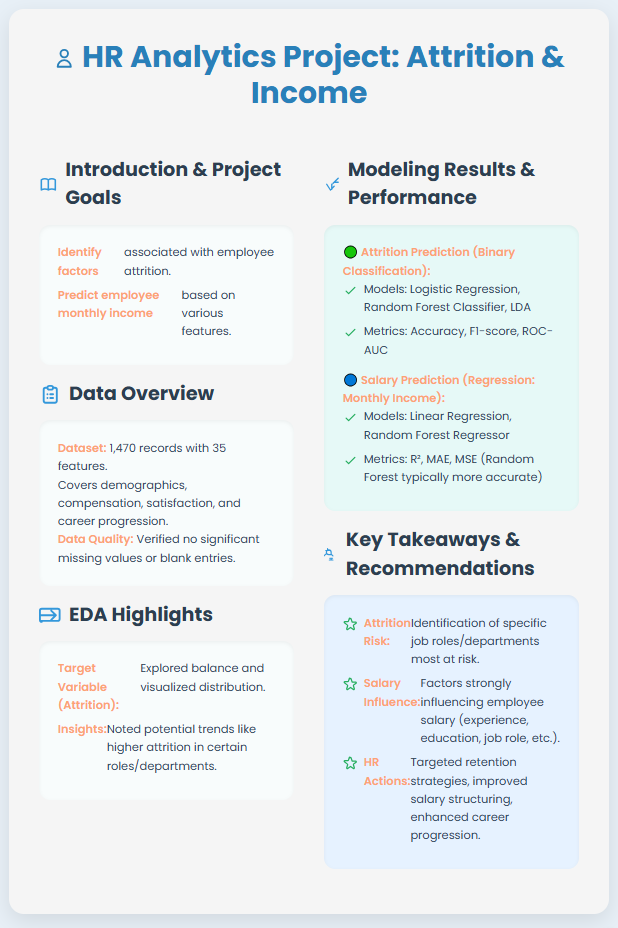

# 📊 Employee Attrition Prediction — ML Project



---

## 📌 Project Overview

This project analyzes employee attrition patterns using the [HR Analytics Dashboard - Employee Attrition Dataset](https://www.kaggle.com/datasets/anubhav761/hr-analytics-dashboard-employee-attrition) from Kaggle. The goal is to predict whether an employee is likely to leave the company using machine learning techniques and also to model and predict monthly income based on various individual and job-related features.

---

## 🎯 Objectives

- Perform **Exploratory Data Analysis (EDA)** to understand key drivers of attrition.
- Build and evaluate classification models (e.g., Logistic Regression, Random Forest, XGBoost).
- Communicate insights that HR teams can use to reduce attrition risk.

---

## 📁 Project Structure

```
employee-attrition-ml/
│
├── module/                    # Your Python module or notebook(s)
├── images/
│   └── infog.png              # Infographic
├── README.md                  # Project overview
└── requirements.txt           # (Optional) dependencies
```

---

## 📈 About the Dataset

- **Source:** [Kaggle HR Analytics Dashboard - Employee Attrition](https://www.kaggle.com/datasets/anubhav761/hr-analytics-dashboard-employee-attrition)  
- **Records:** 1,470 employees  
- **Features:** Demographics, job satisfaction, compensation, career progression, and more.
- **Target:** `Attrition` — whether the employee has left the company (Yes/No). `MonthlyIncome` - Monthly income of the employee.

<details>
<summary>📄 Click for column descriptions</summary>

1. **Age** — Employee age  
2. **Attrition** — Target: Has the employee left? (Yes/No)  
3. **Business Travel** — Travel frequency (Rarely, Frequently, Non-Travel)  
4. **Daily Rate**, **Hourly Rate**, **Monthly Income**, etc. — Compensation details  
5. **Department**, **Job Role**, **Job Level** — Position details  
6. **Job Satisfaction**, **Environment Satisfaction**, **Relationship Satisfaction** — Surveys  
7. **Over Time**, **Distance From Home**, **Years At Company**, **Years Since Last Promotion**, and more.

</details>

---

## 🧪 Main Steps

1. **EDA:** Explore distributions, missing values, and correlations.
2. **Data Preprocessing:** Handle missing data, encode categorical variables, scale features.
3. **Modeling:** Train baseline & advanced classifiers.
4. **Evaluation:** Confusion matrix, ROC-AUC, precision, recall, feature importance.
5. **Insights & Next Steps:** Suggest HR actions, limitations, and possible improvements.

---

## ⚙️ How to Run

- Clone the repo
- Install dependencies (if you have a `requirements.txt`)
- Run the notebook(s) in the `module/` folder step-by-step

```bash
git clone https://github.com/YuryBesiakov/HR-Analytics-Dataset
```

---

## ✅ Key Results

Example: *Random Forest achieved ~85% accuracy and identified overtime and job satisfaction as top attrition drivers.*

---

## 🚀 Next Steps

- Add more advanced explainability (e.g., SHAP or LIME)
- Test additional models
- Deploy a simple demo app (Streamlit or Gradio)

---
